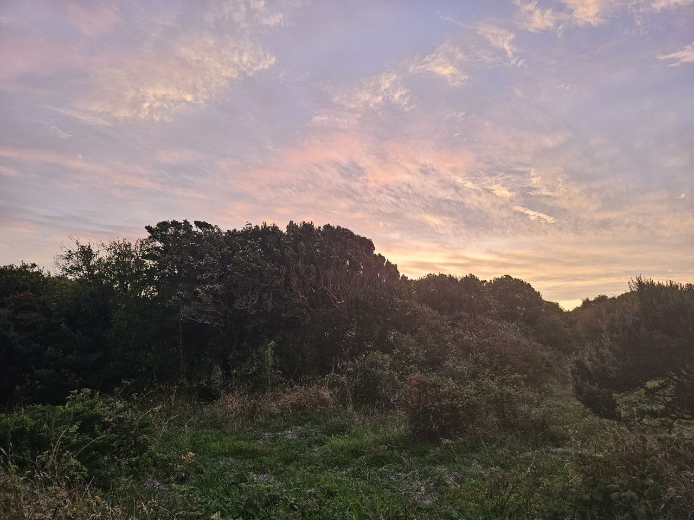

# Hola a Todos👋

    

 

Hola, mi nombre es Maximiliano Varas González (Max) y estudié Ingeniería Civil Eléctrica, mi especialidad es Energía y Inteligencia Computacional. Me interesa el área de ciencia de datos por su importancia a fututo y por la posible aplicación a procesos del mundo eléctrico.

 

    
    
    

## Sobre Mí

 

- 💚 Mis intereses principales son aprender ciencia de datos para aplicarlo en el contexto de energía, predicciones, detección de fallas, etc. También interesado en procesamiento de imagenes y en PLN.
- 🎮 En mis tiempos libres juego Empire Total War, Age of Empires, Transport Fever, etc. En general, juegos de gestión.
- Me gusta hacer deportes.
- Disfruto de leer libros clásicos, en especial de autores rusos.

 
 

## Tech Stack 🛠️

Lenguajes de Programación

Data Science and Machine Learning Frameworks

Enviroments, Containers, Deploy, CI, etc.

Tools & Technologies

Others

